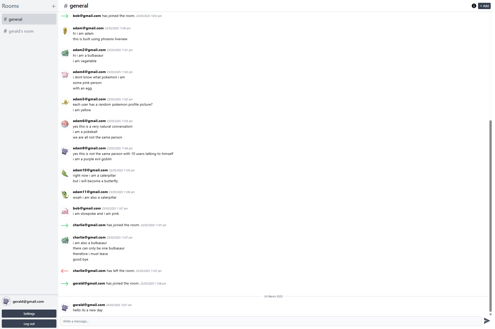

## Real-time Chat Application

This is a real-time chat application built with **Phoenix LiveView**, which is built on top of the **Elixir** programming language. The application uses **PostgreSQL** for data storage and **Tailwind CSS** for styling.

# **[Click here to visit the live demo](https://phoenix-liveview-chat-application.fly.dev/)**

## Features

- **Real-time messaging** using Phoenix's built-in PubSub library.
- **Users can create rooms**, invite friends, and leave groups.
- **Persistent chat history** with infinite scrolling.
- **Responsive design** with Tailwind CSS, inspired by [Discord's UI](https://cdn.prod.website-files.com/5f9072399b2640f14d6a2bf4/6567cd04eadab22634f69221_LTR%20-%20Server%20(1).png).




## Run locally

To set up the application locally:

1. **Clone the repository:**

    ```bash
    git clone https://github.com/yourusername/chat-application.git
    cd chat-application
    mix setup
    ```

3. **Set up the database:**

    Make sure you have PostgreSQL installed. Then run the following commands to create and migrate the database:

    ```bash
    mix ecto.create
    mix ecto.migrate
    ```

4. **Start the Phoenix server:**

    ```bash
    mix phx.server
    ```

    The app will be available at `http://localhost:4000`.
